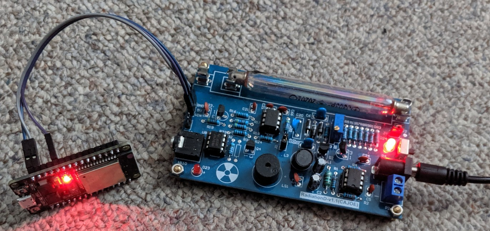
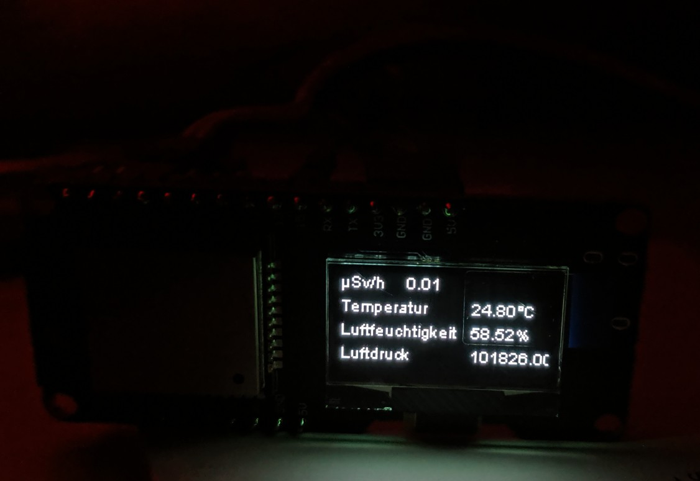

# ESP32 Geiger Counter
This projects uses the ticks from an simple DIY Geiger Counter to send the Data to an MQTT Server. And as I had some spare pins and sensors I added also an BME280 for temperature, presure and humidity, and an little OLED Display to show the values.

I had the idea after watching a Video from Andres Spiess and stole some of his code. https://github.com/SensorsIot/Geiger-Counter-RadiationD-v1.1-CAJOE-

## The Geiger Counter itself
The Geiger counter is a DIY kit commonly sold on AliExpress or Amazon under various names. Some variants are prebuilt. A search for "Geigercounter Detektor Kit GM Tube" should bring some results.
The board can actually hold some different tubes. My board came with an M4011 Tube. The code is optimised for that tube. Be aware that the tube is very light sensitive and you get readings that are extremly high (and wrong) if the tube gets any sunlight.

## How the Data is collected
The Geiger counter tube operates under high voltage and becomes conductive, creating a discharge whenever a high-energy particle interacts with the tube. The board converts this into a 3.3V signal, which is detected by the ESP32. An interrupt is registered on the ESP32 to count how often the tube is hit in one minute. These counts (CPM - Counts Per Minute) are then used to calculate the radiation level.
Keep in mind that radiation is a very random process and we basically deal here with statistics, so as longer as we count, the more accurate but also more averaged is the reading.

## Temperature, Pressure and Humidity
Just as a little addition I added a BME280 module to it. Its by no means relevant for the radiation measurement, so you can leave it it (just comment out that part of the code).
The BME280 is a little more expensive than the famous DHT11, but also more precise and has a Pressure reading. Be carefully when you buy, a lot of Chinese sellers sell you the cheaper BMP180 labeled as a BME280, Even on Amazon with 5 star reviews. Don't place the sensor in very high humidity, it corrodes very quickly.

## The Display
I used a ESP that has a OLED Display integrated.  

## The Code
I used the Arduino IDE 1.8  
you need the following libraries
- EspSoftwareSerial https://github.com/plerup/espsoftwareserial/tree/6.17.1
- WiFi https://github.com/arduino-libraries/WiFi/tree/1.2.7
- time
- PubSubClient https://github.com/knolleary/pubsubclient/tree/v2.8
- esp8266-oled-ssd1306 https://github.com/ThingPulse/esp8266-oled-ssd1306/tree/4.1.0
- BME280 https://github.com/finitespace/BME280/tree/2.3.0
